# Bio-SEDD: Discrete Diffusion for Biological Sequences

This project starts from reproducing the [**Score-Entropy Discrete Diffusion (SEDD)**](https://github.com/louaaron/Score-Entropy-Discrete-Diffusion) framework and extends it toward **biomedical sequence modeling**. The broader goal is to develop a **generalizable bio-SEDD framework** that can be adapted across diverse biomedical datasets.

To achieve this, we fine-tune and upgrade the original SEDD pipeline for biological token sequences, with a focus on improving domain adaptation, sequence quality, robustness to noisy or ambiguous tokens, and compatibility with real biomedical data distributions. The project aims to bridge general discrete diffusion modeling with practical biomedical generation tasks, turning SEDD into a more effective and extensible framework for biosequence modeling.

## Project Target

This project aims to bridge recent advances in discrete diffusion modeling with biological sequence generation. Specifically, it seeks to:

1. reproduce the original SEDD framework faithfully;
2. extend the method to biological sequence datasets through fine-tuning and domain adaptation;
3. analyze the suitability of discrete diffusion for modeling structured biological token distributions; and
4. identify practical improvements that enhance generation fidelity, optimization stability, and biological relevance.

## Why Discrete Diffusion?

Biological sequences are **naturally discrete objects**, formed by **tokens** such as **DNA bases**, **RNA bases**, or **amino acids**. Unlike continuous diffusion, discrete diffusion operates directly in token space, making it a more natural choice for sequence generation tasks.

## Environment Setup

To quickly set up the project environment, run:

```bash
git clone https://github.com/LiuYuqing14/Disrete_Diffusion_Entropy.git
cd Disrete_Diffusion_Entropy
conda env create -f environment.yml
conda activate sedd
```

## Training and Results

## 1. Human Genome hg38

<p align="center">
  
</p>
<p align="center">
  <sub>Training Pipeline for fine-tuning SEDD.</sub>
</p>

### Why hg38 is a good fit for discrete diffusion

A key advantage of discrete diffusion on genomic data is that the **corruption process remains biologically interpretable** throughout the entire generation trajectory.

For example, consider the following sequence corruption process:

```text
Complete sequence:  A T G C A T G C
Noise 25%:          A T G C ? T G C   <- still a valid fragment with a local gap
Noise 50%:          A ? G ? ? T G C   <- resembles a read with sequencing uncertainty
Noise 75%:          ? ? G ? ? ? G ?   <- only a few conserved positions remain
Full noise:         ? ? ? ? ? ? ? ?   <- completely unknown sequence
```
This makes the generation process itself resemble a realistic **biological inference** process: starting from a **fully unknown** sequence, the model gradually fills in each position according to `contextual dependency`, `local motif structure`, and `evolutionary conservation`, eventually reconstructing a meaningful **DNA segment**.
### Result

- **GC content:** `35% ± 5%`
- **N-base ratio:** `7%`
- **Sequence diversity:** partially repetitive

### Improvements
- Full set of **64 canonical 3-mers** from the DNA alphabet `{A, T, G, C}`; `N`-filtering is performed at the base level first, **before k-mer** conversion.
- For DNA sequences, `t ∈ [0.3, 0.7]` contains the **richest learning signal** for genomic reconstruction. A **cosine noise schedule** allocates more effective **masking probability** in this region.

## 2. ProteinGym

### Overview

```text
proteinGym/
├── protein_tokenizer.py   # Embedding: 25 × d_model
├── protein_dataset.py     # ProteinGym dataset load into ProteinGymSequenceDataset & ProteinGymDMSDataset
├── finetune_protein.py    
├── evaluate_protein.py    # Zero-shot scoring
└── configs/
    └── protein.yaml       
```

### Results and Comparison


| Model                                | Mean Spearman ρ | Note                                   |
|--------------------------------------|-----------------|----------------------------------------|
| SEDD-small (zero-shot, no fine-tune) | ~0.30–0.40*     | original SEDD; text token              |
| Bio-SEDD lite (light)                | ~0.40–0.50      | only update embedding & output head    |
| **Bio-SEDD full (heavy)**                | **~0.45–0.55**      | update every weight                    |
| ESM-1v                               | ~0.44           | benchmark by Meta using UniRef90       |
| EVE                                  | ~0.47           | single encoder for each protein family |

*purely transfer with no protein-specific training can still achieve a good result, showing the structural similarities between the pattern of text and that of proteins.


### Improvements

- Replaces both `model.vocab_embed`(embedding) and `model.output_layer`(head) with **randomly initialised matrices** sized for the protein vocabulary, and leave the **transformer backbone**. To address the issue of **limited data**, **transfer learning** is used to apply the attention patterns learned by pre-trained SEDD on text to proteins.
- **Zero-shot scoring** is used as evaluation of model. Reuse the probability ratios calculated by the model in the loss function to **avoid redundant calculations**；**No fitness label** is needed for inference; it can be directly generalized to the new protein family.

## 3.ChEMBL

### Overview

```text
ChEMBL/
├── smiles_tokenizer.py    # Embedding: 94 × d_model; greedy longest-match
├── smiles_dataset.py      # ChEMBL dataset filtered into ChEMBLDataset & ChEMBLPropertyDataset  (drop not truncate)
├── prepare_chembl.py      # Download CSV
├── finetune_smiles.py     
├── evaluate_smiles.py     
└── configs/
    └── chembl.yaml
```


### Results and Comparison

| Model                                | Spearman ρ | AUC                                         |
|--------------------------------------|------------|---------------------------------------------|
| SEDD-small (zero-shot, no fine-tune) | 0.15       | 0.57                                        |
| Bio-SEDD lite (light)                | 0.29       | 0.67                                        | 
| Bio-SEDD full (heavy)                | 0.37       | 0.72                                        | 
| ChemBERTa-77M                               | 0.41       | 0.74                                        |
| **MolBERT**                                  | **0.45**   | **0.77** |

### Reflection

Bio-SEDD doesn't perform well on this dataset compared with the previous, we suggested two reasons:
- **Sequence models are unaware of global syntax constraints**: Since diffusion model can only learn these constraints latently through training data, instead of rigidly restrict like syntax-based generative models.
- **Molecules are essentially graphs, not sequences**: SEDD losses the topology structure of molecules by discretization.